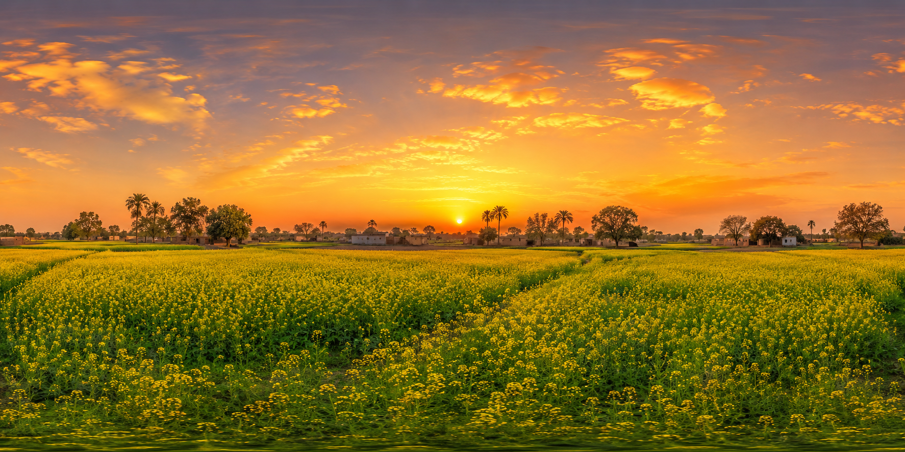

# 🌾 PUNJABI RUNNER
### The Endless Runner — Punjabi Culture Edition

---

## 📖 About the Game

Punjabi Runner is a 3D endless runner game built in Unity 6. 
A brave Punjabi warrior runs through golden mustard fields of 
Punjab, avoiding obstacles on a desi wooden bridge. The game 
celebrates the rich cultural heritage of Punjab — its golden 
fields, warm sunsets, and vibrant colors.

**How far can you run?**

---

## 🎮 Gameplay

- Character runs forward **automatically**
- Player controls **LEFT / RIGHT** movement only
- **Avoid obstacles** on the bridge
- **Fall off = Game Over**
- Score increases every second you survive
- Speed increases over time — stay alert!

---

## ⚙️ Technical Details

| Property | Value |
|---|---|
| Engine | Unity 6 (6000.4.2f1) |
| Language | C# |
| Genre | 3D Endless Runner |
| Platform | Android & Windows |
| Controls | Arrow Keys / Touch |
| Theme | Punjabi Cultural |

---

## 🌾 Punjabi Cultural Theme

- **Background:** Sarson ke khet (mustard fields) + warm sunset
- **Character:** Red kurta + green pagri
- **Bridge:** Earthy brown desi wooden path
- **Obstacles:** Kesri/orange Punjabi colors
- **Menu:** Punjabi night scene with moon and torches
- **Logo:** PUNJABI RUNNER with dhol design
- **Lighting:** Warm golden Punjabi sunshine

---

## 📁 Project Structure
